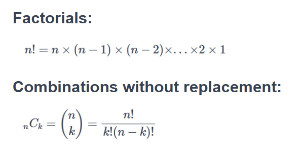

# Lottery Probabilities App

In this project, we will demonstrate how to use various probability tools for data analysis. By the end, we aim to highlight the importance and value of probabilities in predicting and analyzing data.

#### Scenario

This project is based on a hypothetical situation in which a medical institute is developing an app designed to predict the likelihood of winning the lottery. The app specifically targets individuals who struggle with lottery addiction. The goal is to help these individuals understand the actual odds of winning, which may assist them in overcoming their addiction and prevent them from falling deeper into debt.

Our role in this project is to serve as the underlying logic of the app. We will provide answers to hypothetical lottery questions using the same calculations that the app would employ.

View this project live on Google Colab [here](https://colab.research.google.com/drive/1Rru9nvJ0XwM5wDTKrPXb1sZKSRJYgXK-?usp=sharing).
